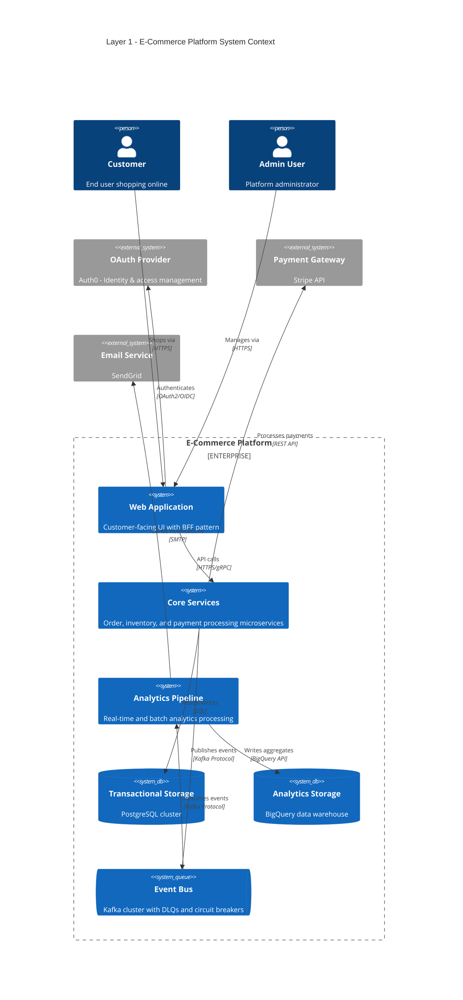
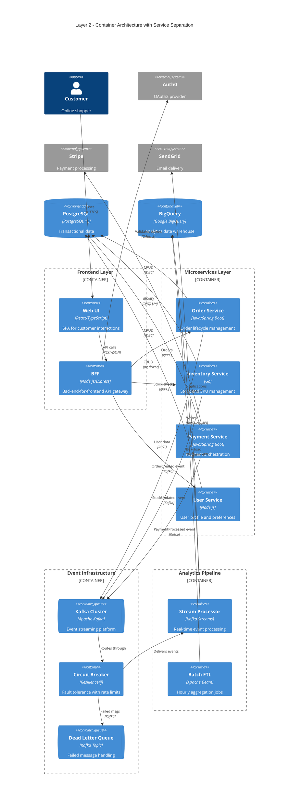
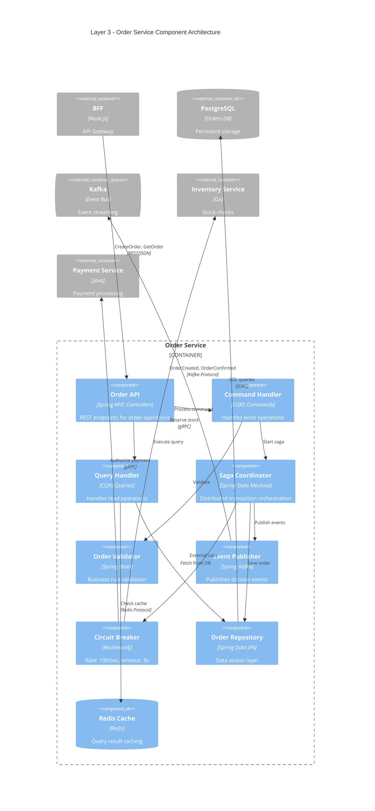
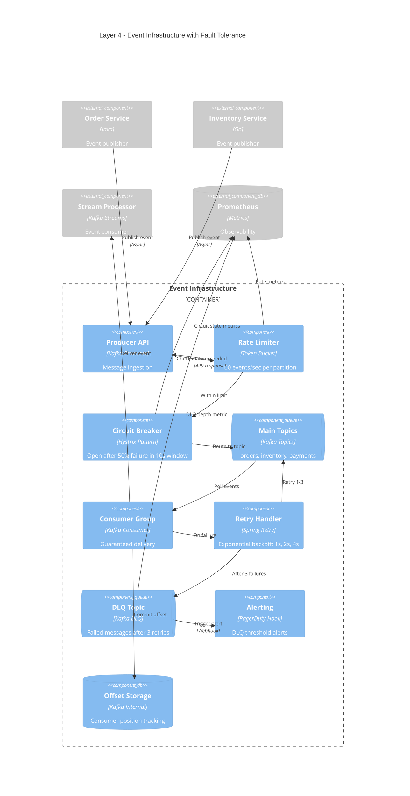
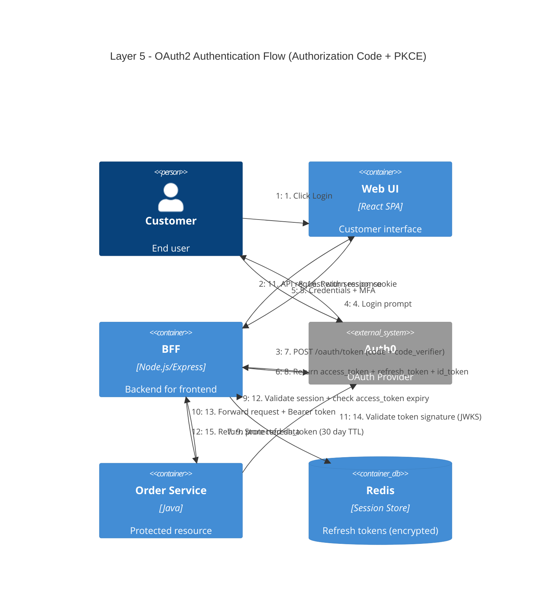

# Distributed Cloud System Architecture - Layered Documentation

This document demonstrates progressive architectural abstraction using C4 diagrams, starting from a high-level system context and drilling down into implementation details of a fictional distributed e-commerce platform.

---

## Layer 1: System Context - Highest Abstraction

**Abstraction Level:** Enterprise-wide view showing major system boundaries and external actors; all microservices grouped into logical domains, databases abstracted as data stores.

---

## Layer 2: Container View - Backend Services Separated

**Abstraction Level:** Microservices decomposed from monolithic grouping; frontend shows BFF separation; messaging infrastructure revealed with rate limiting components.

---

## Layer 3: Component View - Order Service Internals

**Abstraction Level:** Deep dive into Order Service architecture showing internal components, circuit breaker integration, command/query separation, and event publishing patterns.

---

## Layer 4: Event Flow Detail - Circuit Breaker & DLQ Pattern

**Abstraction Level:** Zoom into the event messaging infrastructure showing circuit breaker states, retry logic, rate limiting (100 events/sec), DLQ routing, and monitoring hooks.

---

## Layer 5: Authentication Flow - OAuth Integration Detail

**Abstraction Level:** Maximum detail on the OAuth2/OIDC authentication flow through the BFF, showing token validation, refresh logic, session management, and security boundaries.

---

## Summary

This layered documentation demonstrates:

1. **Layer 1** - System context: All complexity abstracted into 6 major components
2. **Layer 2** - Container view: 15+ containers showing service boundaries and infrastructure
3. **Layer 3** - Component view: Internal architecture of Order Service with CQRS and circuit breakers
4. **Layer 4** - Event infrastructure: Detailed fault tolerance with specific rate limits (100/sec) and retry policies
5. **Layer 5** - Authentication flow: Step-by-step OAuth2 sequence with PKCE security

Each layer removes abstraction to reveal implementation details critical for understanding the distributed system's resilience, scalability, and security patterns.

---

*This document was generated with GitHub Copilot*
